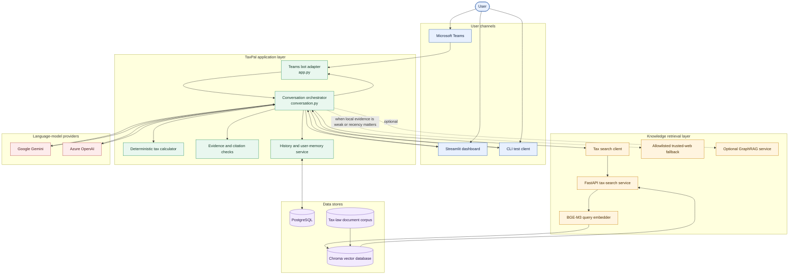
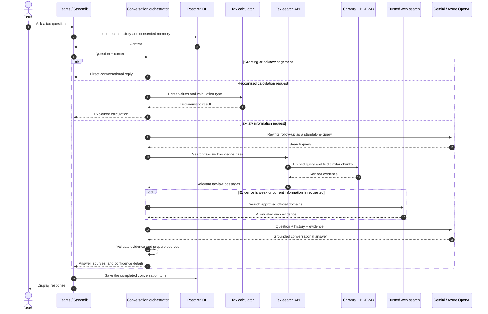
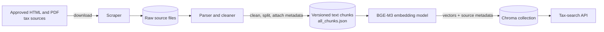
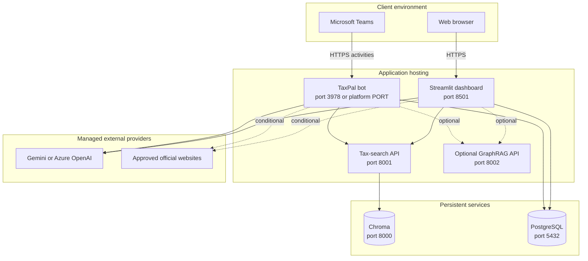

# TaxPal System Architecture

## 1. Architecture overview

TaxPal is a conversational retrieval-augmented generation (RAG) system for
Ugandan tax questions. Users interact through Microsoft Teams or a local
Streamlit dashboard. A shared conversation layer decides whether to respond
conversationally, perform a deterministic tax calculation, or retrieve tax-law
evidence before asking a language model to prepare the answer.

The solid arrows show the normal application path. Dashed arrows identify
conditional or optional retrieval paths. GraphRAG is retained as an optional
extension and is not required for the primary vector-search flow.

## 2. How a question is processed

## 3. Knowledge ingestion flow

The online question-answering path reads from Chroma. A separate ingestion
pipeline prepares and refreshes that knowledge base.

## 4. Deployment view

In local development, Docker Compose provides Chroma, PostgreSQL, tax-search,
and the optional GraphRAG and Langflow services. The Teams bot and Streamlit
dashboard can run from the Python virtual environment or as containers. In a
cloud deployment, Chroma and PostgreSQL require persistent storage, while only
the bot's HTTPS endpoint needs to be public; internal retrieval and database
services should remain private.

## 5. Component responsibilities

| Component | Responsibility | Main implementation |
| --- | --- | --- |
| Teams bot | Receives Teams activities and sends replies | `src/app.py` |
| Streamlit dashboard | Provides local chat, diagnostics, calculator, and evidence views | `src/taxpal_dashboard.py` |
| Conversation orchestrator | Routes requests and coordinates calculation, retrieval, web fallback, generation, and evidence checks | `src/conversation.py` |
| Tax calculator | Produces deterministic VAT and other supported tax calculations | `src/tax_calculator.py` |
| Tax-search client | Calls the private retrieval API with retry and timeout handling | `src/tax_search_client.py` |
| Tax-search API | Exposes health and similarity-search endpoints | `src/tax_search_api.py` |
| Embedder | Creates BGE-M3 embeddings and communicates with Chroma | `src/embedder.py` |
| LLM client | Selects Gemini or Azure OpenAI and builds grounded answers | `src/llm_client.py` |
| Trusted-web module | Retrieves current evidence from approved domains when required | `src/trusted_web.py` |
| Conversation store | Persists history, consent, and user memory | `src/conversation_store.py` |
| Ingestion pipeline | Scrapes, parses, chunks, embeds, and stores the tax corpus | `src/ingest.py` |

## 6. Exporting the diagrams

Each diagram is written in Mermaid, so it can be exported without redrawing it:

1. Copy a diagram's contents, including everything between the `mermaid` code
   fences, into [Mermaid Live Editor](https://mermaid.live/).
2. Select **Actions**, then export it as **SVG** for a Word/PDF report or as
   **PNG** for a slide deck.
3. Prefer SVG where possible because it remains sharp when resized.

For a formal report, use the architecture overview as the main figure and the
sequence diagram as the detailed explanation of the processing flow.
