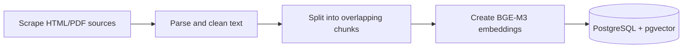

# TaxPal

TaxPal is a retrieval-augmented generation (RAG) assistant for Ugandan tax-law questions. It retrieves relevant passages from a local PostgreSQL/pgvector knowledge base and asks a configured language model to answer using only that evidence.

The project currently supports:

- Google Gemini as the active local development provider.
- Azure OpenAI as an alternative provider.
- A Microsoft Teams bot interface.
- A Streamlit dashboard for inspecting retrieval, evidence, timing, and answers.
- Multi-turn conversation memory with contextual follow-up rewriting.
- PostgreSQL-backed conversation history for Streamlit sessions and Teams conversations.
- Allowlisted live-web fallback for current or weakly supported questions.
- A deterministic conversational VAT calculator shared by Streamlit and Teams.
- A FastAPI tax-law search service.
- A scrape, parse, embed, and store ingestion pipeline.

> TaxPal provides general information, not professional tax or legal advice. Answers should always be checked against the cited legislation and current guidance.

## Current application flow

```mermaid
flowchart LR
    U[User question] --> UI{Interface}
    UI -->|Teams| BOT[Microsoft Teams bot]
    UI -->|Local testing| DASH[Streamlit dashboard]
    UI -->|CLI test| TEST[test_taxpal.py]
    BOT --> CLIENT[tax_search_client.py]
    DASH --> CLIENT
    TEST --> CLIENT
    CLIENT --> API[FastAPI tax-search service]
    API --> EMB[BGE-M3 query embedding]
    EMB --> PG[(PostgreSQL + pgvector)]
    PG --> DOCS[Relevant tax-law chunks]
    DOCS --> CHECK{Evidence sufficient?}
    CHECK -->|No or current question| WEB[Trusted official web search]
    CHECK -->|Yes| LLM
    WEB --> LLM
    LLM[llm_client.py]
    LLM -->|LLM_PROVIDER=gemini| GEMINI[Google Gemini]
    LLM -->|LLM_PROVIDER=azure| AZURE[Azure OpenAI]
    GEMINI --> ANSWER[Grounded answer]
    AZURE --> ANSWER
```



For each question:

1. `conversation.py` reads the current message and recent conversation history.
2. Greetings and acknowledgements receive lightweight conversational replies.
3. A context-dependent follow-up is rewritten into a standalone search question.
4. `tax_search_client.py` calls `POST /search-tax-law` on the FastAPI service.
5. The service embeds the rewritten question with BGE-M3.
6. pgvector returns the most similar tax-law chunks.
7. `llm_client.py` builds a prompt containing recent history, the current question, and retrieved evidence.
8. Gemini or Azure OpenAI generates a grounded conversational answer.
9. The interface stores the turn and displays the answer. Requests such as “explain that more simply” reuse the previous evidence instead of searching again.

When local evidence is missing, scores below the configured threshold, or the user asks for current/latest information, `trusted_web.py` requests grounded search and retains results only from the approved domain allowlist. If live search is unavailable, TaxPal reports that condition and continues with local evidence where possible.

## Active and optional services

| Service | Port | Role | Current answer path |
| --- | ---: | --- | --- |
| PostgreSQL + pgvector | `15432` on host, `5432` in Docker | Stores tax-law embeddings and metadata | Required |
| Tax search API | `8001` | Embeds queries and performs similarity search | Required |
| Teams bot | `3978` | Microsoft Teams interface | Optional interface |
| Streamlit | `8501` | Local flow-testing dashboard | Optional interface |
| Langflow | `7860` | Earlier/experimental visual RAG flow | Not currently used |
| Qdrant | `6333`, `6334` | Earlier/experimental vector store | Not currently used |

`src/app.py` currently imports `tax_search_client` and `llm_client` directly. The older `LangflowClient` integration is retained in the repository but commented out.

## Repository structure

```text
Taxpal/
├── appPackage/                 Teams application manifest and icons
├── data/
│   ├── raw/                    Downloaded HTML and PDF tax sources
│   └── chunks/all_chunks.json  Parsed chunks ready for embedding
├── env/                        Local and Teams Toolkit environment files
├── flow/                       Retained Langflow flow exports
├── infra/                      Azure deployment templates
├── src/
│   ├── app.py                  Microsoft Teams bot
│   ├── scraper.py              Downloads tax-law sources
│   ├── parser.py               Extracts and chunks document text
│   ├── embedder.py             BGE-M3 embeddings and pgvector storage
│   ├── ingest.py               Ingestion pipeline entry point
│   ├── tax_search_api.py       FastAPI retrieval service
│   ├── tax_search_client.py    Async client for the retrieval API
│   ├── llm_client.py           Gemini/Azure provider selection
│   ├── conversation.py         Multi-turn orchestration and retrieval decisions
│   ├── conversation_store.py   PostgreSQL conversation persistence
│   ├── trusted_web.py          Allowlisted live official-source fallback
│   ├── evidence.py             Citation register, validation, and confidence checks
│   ├── user_memory.py          Consent commands and validated profile extraction
│   ├── tax_calculator.py       Decimal-based statutory calculations and intent parsing
│   ├── tax_rules.py            Validated loader for effective-dated rule packs
│   ├── tax_rules/              Versioned Uganda financial-year JSON rules
│   ├── test_taxpal.py          End-to-end CLI flow test
│   └── taxpal_dashboard.py     Streamlit flow dashboard
├── docker-compose.yml          Local service orchestration
├── Dockerfile                  Teams bot image
└── Dockerfile.tax-search       Tax search API image
```

## Prerequisites

- Python `>=3.12,<3.14` is recommended by the project template.
- Docker Desktop with Docker Compose.
- A Gemini API key for the current default flow, or Azure OpenAI credentials.
- Microsoft 365 Agents Toolkit and a Microsoft 365 development account only if testing in Teams.

The existing `src/.venv` may have been created with Python 3.14. It currently works for the tested Gemini and Streamlit flow, but Python 3.12 or 3.13 is recommended for consistency with the project and Docker images.

## Environment configuration

Keep secrets in `env/.env.local`. Do not commit this file.

### Gemini

```dotenv
LLM_PROVIDER=gemini
GEMINI_API_KEY=your-real-gemini-api-key
GEMINI_MODEL=gemini-3.1-flash-lite
```

### Azure OpenAI

```dotenv
LLM_PROVIDER=azure
AZURE_OPENAI_API_KEY=your-real-azure-openai-key
AZURE_OPENAI_ENDPOINT=https://your-resource.openai.azure.com/
AZURE_OPENAI_DEPLOYMENT_NAME=your-chat-model-deployment-name
```

The Azure deployment must support chat completions. A realtime-only deployment such as `gpt-realtime-mini` is not compatible with the current client.

### Retrieval settings

```dotenv
TAX_SEARCH_URL=http://127.0.0.1:8001
POSTGRES_HOST=localhost
POSTGRES_PORT=15432
PGVECTOR_COLLECTION=uganda_tax_law
WEB_RELEVANCE_THRESHOLD=0.35
```

`CONVERSATION_DATABASE_URL` can override the history database connection. By default, history uses the same PostgreSQL instance as pgvector but stores data in a separate `taxpal_conversations` schema.

Environment variables exported in the shell take priority. Otherwise, `llm_client.py` loads `env/.env.local` and then `env/.env`.

## Local setup

Run these commands from the `Taxpal` directory unless stated otherwise.

### 1. Create and install the Python environment

```powershell
cd src
py -3.12 -m venv .venv
.\.venv\Scripts\Activate.ps1
.\.venv\Scripts\python.exe -m pip install --upgrade pip
.\.venv\Scripts\python.exe -m pip install -r requirements.txt
cd ..
```

Using the explicit `.venv` interpreter avoids accidentally running packages from global Python even when the shell prompt displays `(.venv)`.

### 2. Configure the LLM

Create or update `env/.env.local` with one of the provider configurations above. Keep only one `GEMINI_API_KEY` entry to avoid ambiguous values.

### 3. Start the data and retrieval services

To start only the services required by the active local RAG flow:

```powershell
docker compose up -d postgres tax-search
```

To start the complete repository stack, including optional Langflow, Qdrant, and the Teams bot:

```powershell
docker compose up -d
```

The BGE-M3/Torch image is large, so the first `tax-search` build can take several minutes:

```powershell
docker compose build --progress=plain tax-search
docker compose up -d tax-search
```

Check service state:

```powershell
docker compose ps
```

Check the retrieval API:

```powershell
Invoke-RestMethod http://localhost:8001/health
```

Expected response:

```json
{"status":"ok","service":"tax-search"}
```

## Run the end-to-end test

From `Taxpal/src`:

```powershell
.\.venv\Scripts\python.exe test_taxpal.py
```

The test asks a VAT question and should print:

1. The number of retrieved documents.
2. A grounded answer generated by the configured provider.

Successful retrieval followed by an LLM error means the vector search is working and the provider/model configuration needs attention.

## Visualize and test the flow

Launch the Streamlit dashboard from `Taxpal/src`:

```powershell
.\.venv\Scripts\python.exe -m streamlit run taxpal_dashboard.py
```

Open `http://localhost:8501`.

The conversational dashboard displays:

- The active provider and model.
- The question and requested retrieval count.
- Step-by-step execution status.
- Retrieval, generation, and total latency.
- The grounded answer.
- A source metadata table.
- Expandable raw text and metadata for every retrieved chunk.
- Full error details when a stage fails.
- Chat history and contextual follow-up answers.
- The standalone query generated from each follow-up.
- Whether evidence was freshly retrieved or reused.
- Whether trusted official web evidence was added or the fallback was unavailable.
- VAT calculation breakdowns that bypass LLM arithmetic.

The local dashboard keeps an opaque user and conversation identifier in Streamlit session state. It no longer accepts a session identifier from the URL, preventing someone from opening another tester session by copying or changing a query parameter. This tester identity is intentionally temporary; production web deployment still requires an identity provider.

Teams history is namespaced by tenant, authenticated Teams user, and conversation. Every database load, save, and delete is constrained by the stored owner and channel, and an existing session can no longer be reassigned to a different owner.

Set `TAXPAL_ENV=production` in deployed environments. In production mode the bot refuses to start unless `CLIENT_ID` is configured, preventing accidental deployment with Teams authentication disabled. Local development defaults to `development` so emulator testing can still run without registration.

Microsoft 365 Agents Playground uses `TAXPAL_PLAYGROUND=true` to accept mocked unsigned activities during local development. This setting is included in `m365agents.playground.yml`; the application refuses to start if Playground mode is combined with `TAXPAL_ENV=production`.

## Tap-first tax calculator

The Streamlit dashboard includes a visible calculator form with these modes:

- **VAT** — verified 18% default with inclusive/exclusive handling.
- **PAYE** — monthly resident and non-resident progressive bands.
- **Rental income** — resident individual, non-resident individual, and company rules.
- **Withholding tax** — selected verified categories with threshold checks.
- **Corporate income** — 30% of annual chargeable income.
- **Individual business income** — annual resident and non-resident progressive bands.
- **Custom percentage** — the user supplies both the label and flat rate.

Submitting the form creates a normal conversation turn, so results are displayed in chat, saved in history, and use the same calculation engine as Teams. TaxPal also recognizes typed calculations before document retrieval or LLM generation. Examples:

```text
Calculate VAT on UGX 1,000,000
What is the VAT component of UGX 590,000 inclusive?
Calculate VAT on UGX 200,000 at 16%
Calculate 6% withholding tax on UGX 500,000
```

The statutory calculator asks for chargeable income where the law requires it. It does not derive allowable deductions from raw revenue. Results include a direct URA rule link and the date on which the online guidance was verified. Withholding calculations require an explicit payment category and still depend on the payer's withholding obligation, exemptions, and any applicable treaty.

The default standard rate is 18%, based on the project’s ingested Value Added Tax (Rate of Tax) Order, 2005. The calculation uses Python `Decimal` arithmetic and rounds monetary values to two decimal places.

- VAT-exclusive: `VAT = net amount × rate / 100`
- VAT-inclusive component: `VAT = gross amount × rate / (100 + rate)`

An explicitly supplied custom percentage is labelled as a user-specified rate rather than an official standard rate. It reports the percentage amount without assuming whether that amount should be added, withheld, or deducted. The calculator provides general information and does not determine whether a particular supply is taxable, exempt, or zero-rated.

The rule set was verified against current URA guidance on 16 August 2026. Tax law can change, so the verification date and source links must be reviewed when a new financial year or amendment takes effect.

### Versioned tax years

Statutory values are stored outside the Python calculation engine:

```text
src/tax_rules/
├── uganda_2025_26.json
└── uganda_2026_27.json
```

Each rule pack records its financial year, effective dates, immutable version identifier, verification date, source links, rates, bands, thresholds, and caps. The dashboard tax-year selector defaults to `2026/27`; typed chat and Teams requests can select a supported year with phrases such as `for tax year 2025/26` or `FY 2025-26`.

Every statutory result stores and displays `tax_year`, `rule_version`, `effective_from`, `effective_to`, and `verified_on`. Unsupported years are rejected instead of being calculated with another year's rules. To introduce a new year, add and review a new JSON pack rather than modifying a historical pack that may already be referenced by saved calculations.

## Evidence and citation controls

Retrieved documents receive deterministic citation identifiers (`[S1]`, `[S2]`, and so on) before generation. The LLM may cite only those identifiers after factual claims. TaxPal independently validates the identifiers and appends a structured source register, so model-generated URLs are not treated as authoritative.

Each citation records its title, section, publisher, URL, evidence origin, relevance score, and publication, effective, or access dates where available. The evidence assessment reports:

- High, moderate, or low confidence.
- Missing claim-level citation markers or unknown identifiers.
- Missing source dates or sources outside their effective period.
- Conflicts when sources provide the same structured `claim_key` with differing `claim_value` metadata.

The Streamlit evidence table displays this provenance. Teams receives the same answer with its source register appended. Confidence is an evidence-quality signal, not a guarantee that tax advice is correct.

## Consent-based conversation memory

Remembered profile data is separate from chat history and is stored per authenticated owner and channel. TaxPal remembers nothing until the user opts in. The allowed profile is deliberately limited to residency, taxpayer type, preferred tax year, frequent tax, and business sector; values are validated server-side and must be explicitly stated or saved through the dashboard.

Teams memory commands include:

```text
Remember my tax profile
I am a non-resident
My taxpayer type is company
My preferred tax year is 2025/26
I usually calculate VAT
My business sector is hospitality
Show my profile
Forget my profile
```

The Streamlit sidebar provides equivalent opt-in, view, update, and confirmed-delete controls. Clearing conversation history does not delete the remembered profile, and deleting the profile does not delete conversation history. Remembered values personalize explanations only: TaxPal is instructed to reconfirm facts that determine residency, liability, exemptions, or calculator inputs.

## Trusted live sources

Live fallback is restricted to the allowlist in `src/trusted_web.py`:

- Uganda Revenue Authority — `ura.go.ug`
- Uganda Legal Information Institute — `ulii.org`
- Ministry of Finance, Planning and Economic Development — `finance.go.ug`
- Parliament of Uganda — `parliament.go.ug`
- Bank of Uganda — `bou.or.ug`

TaxPal triggers live search when:

- No local documents are returned.
- Scored local evidence is below `WEB_RELEVANCE_THRESHOLD`.
- The user supplies an HTTPS URL on an allowlisted official domain.
- The question contains a current-information request such as “latest,” “recent,” “today,” or “check official sources.”

Explicit official URLs are fetched directly without consuming Gemini grounding quota. Direct retrieval requires HTTPS, validates every redirect against the allowlist, rejects embedded credentials and nonstandard ports, limits download and extracted-text sizes, and accepts HTML, plain text, or PDF content. Scripts, forms, navigation, and other non-evidence HTML are removed before generation.

For search-based discovery, only grounding citations identified as an approved domain and delivered through an approved HTTPS URL or Google grounding redirect enter the final evidence set. Each accepted source is labelled `trusted_web` and records its organization, URL, canonical domain, access time, and transport-security decision. An unavailable or quota-limited web search does not prevent a local-document answer.

## Ingest or refresh tax-law data

The ingestion pipeline has three stages:



Start PostgreSQL first:

```powershell
docker compose up -d postgres
```

Then run the complete pipeline from `Taxpal/src`:

```powershell
.\.venv\Scripts\python.exe ingest.py
```

Individual stages are also available:

```powershell
.\.venv\Scripts\python.exe ingest.py --scrape-only
.\.venv\Scripts\python.exe ingest.py --parse-only
.\.venv\Scripts\python.exe ingest.py --embed-only
```

`--embed-only` reads `data/chunks/all_chunks.json`. Host-side ingestion connects to PostgreSQL through port `15432`; the Dockerized search API connects internally through port `5432`.

## Open Microsoft 365 Agents Playground

On Windows, double-click `start-taxpal-playground.cmd` in the `Taxpal` folder. The launcher automatically:

- starts Docker Desktop when needed;
- starts PostgreSQL and the tax-search service;
- starts the TaxPal bot on port `3978`;
- starts Microsoft 365 Agents Playground on port `56150`; and
- opens `http://localhost:56150` in the default browser.

Keep the terminal window open while the launcher performs its checks. When you finish, double-click `stop-taxpal-playground.cmd`. This stops the bot and Playground processes started by the launcher; the Docker services remain running so the next launch is faster.

If a launch fails, inspect the text files in `Taxpal/.runtime`. They contain separate bot and Playground output and error logs. The generated `.runtime` folder is ignored by Git.

The same commands can be run from a terminal:

```powershell
.\start-taxpal-playground.cmd
.\stop-taxpal-playground.cmd
```

## Run only the Teams bot

For local Python execution, ensure PostgreSQL and `tax-search` are running, then run from `Taxpal/src`:

```powershell
$env:TAX_SEARCH_URL="http://localhost:8001"
.\.venv\Scripts\python.exe app.py
```

The bot listens on port `3978`. Use Microsoft 365 Agents Toolkit debugging to register and open it in Teams.

Important: the current Compose definition does not inject `env/.env.local` into the `taxpal-bot` container. Running the bot inside Docker therefore requires adding the selected provider variables to the Compose service through an `env_file` or explicit `environment` entries. Do not bake API keys into an image or commit them to `docker-compose.yml`.

## API reference

### Health

```http
GET /health
```

### Search tax law

```http
POST /search-tax-law
Content-Type: application/json

{
  "query": "What is the standard VAT rate in Uganda?",
  "k": 4
}
```

Example PowerShell request:

```powershell
$body = @{
    query = "What is the standard VAT rate in Uganda?"
    k = 4
} | ConvertTo-Json

Invoke-RestMethod `
    -Uri http://localhost:8001/search-tax-law `
    -Method Post `
    -ContentType application/json `
    -Body $body
```

## Tests

Run the isolated conversation, trust-policy, and scraper unit tests from `Taxpal/src`:

```powershell
$env:PYTHONIOENCODING="utf-8"
.\.venv\Scripts\python.exe -m unittest test_scraper.py test_conversation.py test_trusted_web.py test_tax_calculator.py
```

Notes:

- `test_taxpal.py` is an end-to-end executable test and makes a real LLM request; run it separately as documented above.
- `test_pgvector.py` is currently an executable integration script rather than an isolated unit test; importing it loads BGE-M3 and connects to PostgreSQL.
- `test_scraper.py` is the small isolated unit test.
- `test_conversation.py` verifies conversational replies and evidence reuse without calling external services.
- `test_trusted_web.py` verifies domain rejection, current-query routing, and relevance thresholds without calling external services.
- `test_tax_calculator.py` verifies inclusive/exclusive VAT, custom rates, input validation, and conversational parsing.
- Do not use broad unittest discovery yet because the two integration scripts execute external work when imported.

## Troubleshooting

### `ImportError: cannot import name 'genai' from 'google'`

The active interpreter does not contain `google-genai`. Install it into the project environment and use that interpreter explicitly:

```powershell
.\.venv\Scripts\python.exe -m pip install google-genai
.\.venv\Scripts\python.exe test_taxpal.py
```

Confirm the interpreter:

```powershell
.\.venv\Scripts\python.exe -c "import sys; print(sys.executable)"
```

### Gemini returns `404 NOT_FOUND`

The selected model may no longer be available to the API key. Set `GEMINI_MODEL` to a model returned by the Gemini models API. The currently tested model is `gemini-3.1-flash-lite`.

### Gemini returns `503 UNAVAILABLE`

The model is temporarily under high demand. Retry later or select another supported model. A broad alias such as `gemini-flash-latest` may point to a busier model.

### Gemini live search returns `429 RESOURCE_EXHAUSTED`

The API key has exhausted its current grounding/search quota. Local retrieval remains available. Wait for quota reset or adjust the Gemini project’s quota/billing before retrying an explicit “check official sources” question.

### `The requested operation is unsupported` from Azure

The configured deployment does not support the Chat Completions call. Use a chat-capable Azure OpenAI deployment rather than a realtime-only model.

### Tax search cannot resolve `{POSTGRES_HOST}`

The running Docker image is stale. Rebuild it:

```powershell
docker compose build --no-cache tax-search
docker compose up -d tax-search
```

### Host can connect but containers cannot connect to PostgreSQL

- Host programs use `localhost:15432`.
- Compose services use `postgres:5432`.

### `RemoteProtocolError: Server disconnected without sending a response`

First confirm `http://127.0.0.1:8001/health` responds. BGE-M3 can take several minutes to download and warm up after the first build. Host-side Python should use `TAX_SEARCH_URL=http://127.0.0.1:8001`; on some Windows/Docker configurations, `localhost` resolves through an unreliable IPv6 or proxy path. The client retries transient transport errors and ignores ambient proxy variables for this local service.

### Search returns a pgvector schema error

Do not delete the database volume immediately. Inspect the existing table and preserve indexed data before migrating or recreating the schema:

```powershell
docker exec taxpal-postgres psql -U taxpal -d taxpal -c "SELECT count(*) FROM langchain_pg_embedding;"
```

## Security and data quality

- Never commit `env/.env.local`, API keys, access tokens, or passwords.
- Conversation history contains user questions and generated answers. Apply retention rules and authentication before production use.
- Treat retrieved text as evidence, not as automatically correct law.
- Keep document dates and sources in chunk metadata.
- Re-ingest when legislation or official guidance changes.
- Review generated answers before relying on them for filing or compliance decisions.

## Current limitations

- The answer generator does not yet emit structured citations linking every claim to a specific retrieved chunk.
- Retrieval quality has no automated evaluation dataset or relevance metrics yet.
- The Teams Docker service needs provider secrets injected at runtime.
- The Streamlit dashboard is a local tester, not an authenticated production portal. Add Microsoft Entra ID or another identity provider before exposing it publicly.
- Trusted web evidence currently depends on Gemini grounding quota and availability.
- Langflow and Qdrant remain in Compose even though the current production path uses FastAPI and pgvector.
- Several integration scripts perform work during import and should eventually be converted into isolated tests.
