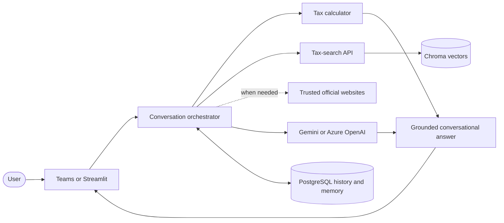

# TaxPal

TaxPal is a conversational assistant for Ugandan tax information. It combines
retrieval-augmented generation (RAG), deterministic tax calculations, trusted
official sources, and consent-based conversation memory. Users can interact
through Microsoft Teams or a local Streamlit dashboard.

> TaxPal provides general information, not professional tax or legal advice.
> Important decisions should be checked against current legislation and Uganda
> Revenue Authority guidance.

## Key capabilities

- Conversational answers to Ugandan tax questions
- Chroma vector retrieval using BGE-M3 embeddings
- Google Gemini or Azure OpenAI answer generation
- Deterministic VAT, PAYE, rental income, withholding, corporate income, and
  individual business-income calculations
- Versioned financial-year tax rules
- Evidence assessment and readable source lists
- Web fallback restricted to approved official domains
- PostgreSQL chat history and opt-in user preferences
- Microsoft Teams bot and Streamlit diagnostic dashboard
- Optional GraphRAG augmentation

## System overview



## Documentation

| Document | Purpose |
| --- | --- |
| [Getting started](docs/GETTING_STARTED.md) | Install and run TaxPal locally |
| [User guide](docs/USER_GUIDE.md) | Use chat, calculations, memory, and sources |
| [Developer guide](docs/DEVELOPER_GUIDE.md) | Understand and extend the code |
| [Testing and troubleshooting](docs/TESTING_AND_TROUBLESHOOTING.md) | Test and diagnose the system |
| [Architecture](ARCHITECTURE.md) | Report-ready diagrams and responsibilities |
| [Progress report](PROJECT_PROGRESS_REPORT.md) | Activities, skills, challenges, and status |
| [Azure deployment](AZURE_DEPLOYMENT.md) | Optional future cloud deployment |

## Quick start

Prerequisites: Windows PowerShell, Python 3.12 or 3.13, Docker Desktop, and a
Gemini API key or compatible Azure OpenAI deployment.

```powershell
cd src
py -3.12 -m venv .venv
.\.venv\Scripts\Activate.ps1
python -m pip install --upgrade pip
python -m pip install -r requirements.txt
cd ..
Copy-Item env\.env.example env\.env.local
```

Set the provider in `env/.env.local`:

```dotenv
LLM_PROVIDER=gemini
GEMINI_API_KEY=your-real-api-key
GEMINI_MODEL=gemini-3.1-flash-lite
```

Start the active services and dashboard:

```powershell
docker compose up -d chroma postgres tax-search
Invoke-RestMethod http://127.0.0.1:8001/health
cd src
.\.venv\Scripts\python.exe -m streamlit run taxpal_dashboard.py
```

Open `http://localhost:8501`. Full instructions are in the
[getting-started guide](docs/GETTING_STARTED.md).

## Main services

| Service | Host port | Purpose | Required |
| --- | ---: | --- | --- |
| Chroma | `18000` | Tax-law vectors | Yes |
| PostgreSQL | `15432` | History and consented memory | For persistence |
| Tax-search API | `8001` | BGE-M3 similarity search | Yes |
| Teams bot | `3978` | Teams messaging | For Teams only |
| Streamlit | `8501` | Local chat and diagnostics | For dashboard only |
| GraphRAG | `8002` | Optional graph retrieval | No |

## Repository map

```text
Taxpal/
|-- appPackage/              Teams manifest and icons
|-- data/                    Raw sources and parsed chunks
|-- docs/                    Task-focused documentation
|-- env/                     Local and Toolkit environment files
|-- infra/                   Azure infrastructure templates
|-- scripts/                 Playground and deployment helpers
|-- src/
|   |-- app.py               Teams bot
|   |-- conversation.py      Conversation and RAG orchestration
|   |-- taxpal_dashboard.py  Streamlit interface
|   |-- tax_search_api.py    Retrieval API
|   |-- embedder.py          BGE-M3 and Chroma integration
|   |-- llm_client.py        Model-provider integration
|   |-- tax_calculator.py    Calculation engine
|   `-- conversation_store.py PostgreSQL persistence
|-- docker-compose.yml       Local services
|-- Dockerfile               Bot image
`-- Dockerfile.tax-search    Retrieval image
```

## Current status

TaxPal is a functional local prototype. Streamlit and Microsoft 365 Agents
Playground flows have been exercised, vector storage uses Chroma, and the system
supports conversational retrieval, calculations, official-source fallback,
and persistent history. Azure files are prepared for future use, but deployment
is not currently required.

Production work still includes authenticated web access, formal retrieval
evaluation, retention-policy enforcement, monitoring, and professional review
of tax-rule updates.

## Security

- Never commit `env/.env.local`, API keys, secrets, or passwords.
- Keep Chroma and PostgreSQL private.
- Treat conversation history as personal data.
- Store preferences only after explicit consent.
- Review sources and rule packs whenever legislation changes.

## License

No license file is currently included. Add an approved license before external
distribution.
