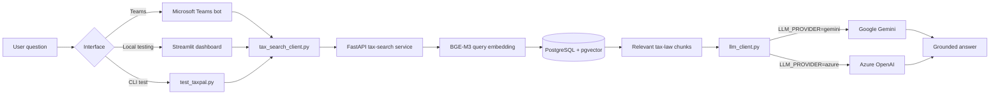
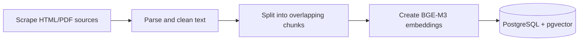

# TaxPal

TaxPal is a retrieval-augmented generation (RAG) assistant for Ugandan tax-law questions. It retrieves relevant passages from a local PostgreSQL/pgvector knowledge base and asks a configured language model to answer using only that evidence.

The project currently supports:

- Google Gemini as the active local development provider.
- Azure OpenAI as an alternative provider.
- A Microsoft Teams bot interface.
- A Streamlit dashboard for inspecting retrieval, evidence, timing, and answers.
- Multi-turn conversation memory with contextual follow-up rewriting.
- A FastAPI tax-law search service.
- A scrape, parse, embed, and store ingestion pipeline.

> TaxPal provides general information, not professional tax or legal advice. Answers should always be checked against the cited legislation and current guidance.

## Current application flow



For each question:

1. `conversation.py` reads the current message and recent conversation history.
2. Greetings and acknowledgements receive lightweight conversational replies.
3. A context-dependent follow-up is rewritten into a standalone search question.
4. `tax_search_client.py` calls `POST /search-tax-law` on the FastAPI service.
5. The service embeds the rewritten question with BGE-M3.
6. pgvector returns the most similar tax-law chunks.
7. `llm_client.py` builds a prompt containing recent history, the current question, and retrieved evidence.
8. Gemini or Azure OpenAI generates a grounded conversational answer.
9. The interface stores the turn and displays the answer. Requests such as “explain that more simply” reuse the previous evidence instead of searching again.

## Active and optional services

| Service | Port | Role | Current answer path |
| --- | ---: | --- | --- |
| PostgreSQL + pgvector | `15432` on host, `5432` in Docker | Stores tax-law embeddings and metadata | Required |
| Tax search API | `8001` | Embeds queries and performs similarity search | Required |
| Teams bot | `3978` | Microsoft Teams interface | Optional interface |
| Streamlit | `8501` | Local flow-testing dashboard | Optional interface |
| Langflow | `7860` | Earlier/experimental visual RAG flow | Not currently used |
| Qdrant | `6333`, `6334` | Earlier/experimental vector store | Not currently used |

`src/app.py` currently imports `tax_search_client` and `llm_client` directly. The older `LangflowClient` integration is retained in the repository but commented out.

## Repository structure

```text
Taxpal/
├── appPackage/                 Teams application manifest and icons
├── data/
│   ├── raw/                    Downloaded HTML and PDF tax sources
│   └── chunks/all_chunks.json  Parsed chunks ready for embedding
├── env/                        Local and Teams Toolkit environment files
├── flow/                       Retained Langflow flow exports
├── infra/                      Azure deployment templates
├── src/
│   ├── app.py                  Microsoft Teams bot
│   ├── scraper.py              Downloads tax-law sources
│   ├── parser.py               Extracts and chunks document text
│   ├── embedder.py             BGE-M3 embeddings and pgvector storage
│   ├── ingest.py               Ingestion pipeline entry point
│   ├── tax_search_api.py       FastAPI retrieval service
│   ├── tax_search_client.py    Async client for the retrieval API
│   ├── llm_client.py           Gemini/Azure provider selection
│   ├── conversation.py         Multi-turn orchestration and retrieval decisions
│   ├── test_taxpal.py          End-to-end CLI flow test
│   └── taxpal_dashboard.py     Streamlit flow dashboard
├── docker-compose.yml          Local service orchestration
├── Dockerfile                  Teams bot image
└── Dockerfile.tax-search       Tax search API image
```

## Prerequisites

- Python `>=3.12,<3.14` is recommended by the project template.
- Docker Desktop with Docker Compose.
- A Gemini API key for the current default flow, or Azure OpenAI credentials.
- Microsoft 365 Agents Toolkit and a Microsoft 365 development account only if testing in Teams.

The existing `src/.venv` may have been created with Python 3.14. It currently works for the tested Gemini and Streamlit flow, but Python 3.12 or 3.13 is recommended for consistency with the project and Docker images.

## Environment configuration

Keep secrets in `env/.env.local`. Do not commit this file.

### Gemini

```dotenv
LLM_PROVIDER=gemini
GEMINI_API_KEY=your-real-gemini-api-key
GEMINI_MODEL=gemini-3.1-flash-lite
```

### Azure OpenAI

```dotenv
LLM_PROVIDER=azure
AZURE_OPENAI_API_KEY=your-real-azure-openai-key
AZURE_OPENAI_ENDPOINT=https://your-resource.openai.azure.com/
AZURE_OPENAI_DEPLOYMENT_NAME=your-chat-model-deployment-name
```

The Azure deployment must support chat completions. A realtime-only deployment such as `gpt-realtime-mini` is not compatible with the current client.

### Retrieval settings

```dotenv
TAX_SEARCH_URL=http://localhost:8001
POSTGRES_HOST=localhost
POSTGRES_PORT=15432
PGVECTOR_COLLECTION=uganda_tax_law
```

Environment variables exported in the shell take priority. Otherwise, `llm_client.py` loads `env/.env.local` and then `env/.env`.

## Local setup

Run these commands from the `Taxpal` directory unless stated otherwise.

### 1. Create and install the Python environment

```powershell
cd src
py -3.12 -m venv .venv
.\.venv\Scripts\Activate.ps1
.\.venv\Scripts\python.exe -m pip install --upgrade pip
.\.venv\Scripts\python.exe -m pip install -r requirements.txt
cd ..
```

Using the explicit `.venv` interpreter avoids accidentally running packages from global Python even when the shell prompt displays `(.venv)`.

### 2. Configure the LLM

Create or update `env/.env.local` with one of the provider configurations above. Keep only one `GEMINI_API_KEY` entry to avoid ambiguous values.

### 3. Start the data and retrieval services

To start only the services required by the active local RAG flow:

```powershell
docker compose up -d postgres tax-search
```

To start the complete repository stack, including optional Langflow, Qdrant, and the Teams bot:

```powershell
docker compose up -d
```

The BGE-M3/Torch image is large, so the first `tax-search` build can take several minutes:

```powershell
docker compose build --progress=plain tax-search
docker compose up -d tax-search
```

Check service state:

```powershell
docker compose ps
```

Check the retrieval API:

```powershell
Invoke-RestMethod http://localhost:8001/health
```

Expected response:

```json
{"status":"ok","service":"tax-search"}
```

## Run the end-to-end test

From `Taxpal/src`:

```powershell
.\.venv\Scripts\python.exe test_taxpal.py
```

The test asks a VAT question and should print:

1. The number of retrieved documents.
2. A grounded answer generated by the configured provider.

Successful retrieval followed by an LLM error means the vector search is working and the provider/model configuration needs attention.

## Visualize and test the flow

Launch the Streamlit dashboard from `Taxpal/src`:

```powershell
.\.venv\Scripts\python.exe -m streamlit run taxpal_dashboard.py
```

Open `http://localhost:8501`.

The conversational dashboard displays:

- The active provider and model.
- The question and requested retrieval count.
- Step-by-step execution status.
- Retrieval, generation, and total latency.
- The grounded answer.
- A source metadata table.
- Expandable raw text and metadata for every retrieved chunk.
- Full error details when a stage fails.
- Chat history and contextual follow-up answers.
- The standalone query generated from each follow-up.
- Whether evidence was freshly retrieved or reused.

## Ingest or refresh tax-law data

The ingestion pipeline has three stages:



Start PostgreSQL first:

```powershell
docker compose up -d postgres
```

Then run the complete pipeline from `Taxpal/src`:

```powershell
.\.venv\Scripts\python.exe ingest.py
```

Individual stages are also available:

```powershell
.\.venv\Scripts\python.exe ingest.py --scrape-only
.\.venv\Scripts\python.exe ingest.py --parse-only
.\.venv\Scripts\python.exe ingest.py --embed-only
```

`--embed-only` reads `data/chunks/all_chunks.json`. Host-side ingestion connects to PostgreSQL through port `15432`; the Dockerized search API connects internally through port `5432`.

## Run the Teams bot

For local Python execution, ensure PostgreSQL and `tax-search` are running, then run from `Taxpal/src`:

```powershell
$env:TAX_SEARCH_URL="http://localhost:8001"
.\.venv\Scripts\python.exe app.py
```

The bot listens on port `3978`. Use Microsoft 365 Agents Toolkit debugging to register and open it in Teams.

Important: the current Compose definition does not inject `env/.env.local` into the `taxpal-bot` container. Running the bot inside Docker therefore requires adding the selected provider variables to the Compose service through an `env_file` or explicit `environment` entries. Do not bake API keys into an image or commit them to `docker-compose.yml`.

## API reference

### Health

```http
GET /health
```

### Search tax law

```http
POST /search-tax-law
Content-Type: application/json

{
  "query": "What is the standard VAT rate in Uganda?",
  "k": 4
}
```

Example PowerShell request:

```powershell
$body = @{
    query = "What is the standard VAT rate in Uganda?"
    k = 4
} | ConvertTo-Json

Invoke-RestMethod `
    -Uri http://localhost:8001/search-tax-law `
    -Method Post `
    -ContentType application/json `
    -Body $body
```

## Tests

Run the isolated conversation and scraper unit tests from `Taxpal/src`:

```powershell
$env:PYTHONIOENCODING="utf-8"
.\.venv\Scripts\python.exe -m unittest test_scraper.py test_conversation.py
```

Notes:

- `test_taxpal.py` is an end-to-end executable test and makes a real LLM request; run it separately as documented above.
- `test_pgvector.py` is currently an executable integration script rather than an isolated unit test; importing it loads BGE-M3 and connects to PostgreSQL.
- `test_scraper.py` is the small isolated unit test.
- `test_conversation.py` verifies conversational replies and evidence reuse without calling external services.
- Do not use broad unittest discovery yet because the two integration scripts execute external work when imported.

## Troubleshooting

### `ImportError: cannot import name 'genai' from 'google'`

The active interpreter does not contain `google-genai`. Install it into the project environment and use that interpreter explicitly:

```powershell
.\.venv\Scripts\python.exe -m pip install google-genai
.\.venv\Scripts\python.exe test_taxpal.py
```

Confirm the interpreter:

```powershell
.\.venv\Scripts\python.exe -c "import sys; print(sys.executable)"
```

### Gemini returns `404 NOT_FOUND`

The selected model may no longer be available to the API key. Set `GEMINI_MODEL` to a model returned by the Gemini models API. The currently tested model is `gemini-3.1-flash-lite`.

### Gemini returns `503 UNAVAILABLE`

The model is temporarily under high demand. Retry later or select another supported model. A broad alias such as `gemini-flash-latest` may point to a busier model.

### `The requested operation is unsupported` from Azure

The configured deployment does not support the Chat Completions call. Use a chat-capable Azure OpenAI deployment rather than a realtime-only model.

### Tax search cannot resolve `{POSTGRES_HOST}`

The running Docker image is stale. Rebuild it:

```powershell
docker compose build --no-cache tax-search
docker compose up -d tax-search
```

### Host can connect but containers cannot connect to PostgreSQL

- Host programs use `localhost:15432`.
- Compose services use `postgres:5432`.

### Search returns a pgvector schema error

Do not delete the database volume immediately. Inspect the existing table and preserve indexed data before migrating or recreating the schema:

```powershell
docker exec taxpal-postgres psql -U taxpal -d taxpal -c "SELECT count(*) FROM langchain_pg_embedding;"
```

## Security and data quality

- Never commit `env/.env.local`, API keys, access tokens, or passwords.
- Treat retrieved text as evidence, not as automatically correct law.
- Keep document dates and sources in chunk metadata.
- Re-ingest when legislation or official guidance changes.
- Review generated answers before relying on them for filing or compliance decisions.

## Current limitations

- The answer generator does not yet emit structured citations linking every claim to a specific retrieved chunk.
- Retrieval quality has no automated evaluation dataset or relevance metrics yet.
- The Teams Docker service needs provider secrets injected at runtime.
- Teams memory is currently held in the bot process and is lost on restart; PostgreSQL-backed conversation persistence is the next step.
- Langflow and Qdrant remain in Compose even though the current production path uses FastAPI and pgvector.
- Several integration scripts perform work during import and should eventually be converted into isolated tests.
